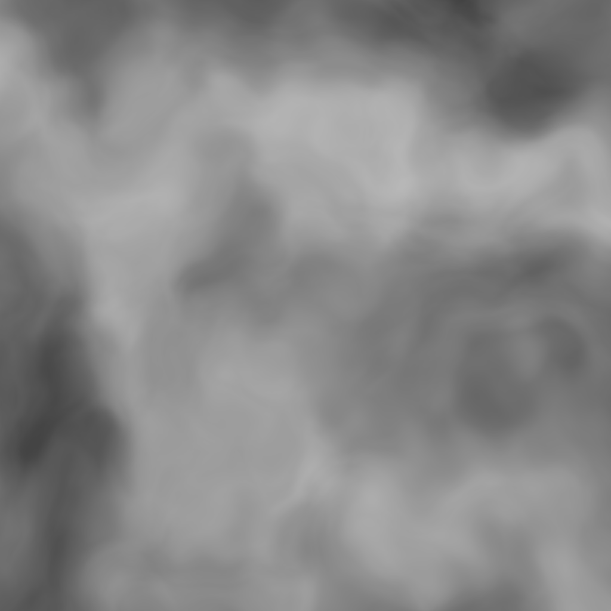

# mfiano.graphics.procgen.ricket

Cricket is a comprehensive suite of coherent noise algorithms and composable tools for manipulating
them to create interesting procedurally-generated imagery and other creative applications.

## What is coherent noise?

Unlike its more random cousin, coherent noise has interesting properties that give it a smooth
appearance. A coherent noise function is an N-arity function that emits a single scalar value as its
output. All coherent noise functions exhibit the following properties:

1. The same input parameters will always result in the same output.
2. A small change in input will result in a small change in the output.
3. A large change in input will result in a random output.

The dimensionality of a coherent noise function is determined by how many input parameters it
accepts. Since inputs to a coherent noise function could be driven from any source of data, and
output values are coherent in each of the function's supported dimensions, one could feed image
coordinates into a 3-dimensional coherent noise function's first two parameters, and an incrementing
time value as the third parameter, in order to smoothly animate an image effect such as clouds,
fire, landscapes, or anything else creativity dreams up.

Coherent noise functions are especially ubiquitous in applications where memory is scarce, and in
game development where one wants to generate 2-dimensional textures or 3-dimensional objects without
storing any large chunks of image or geometry data on disk.

## Overview

Cricket started out as a collection of noise algorithms for use in game development,  but evolved
over time into a more general form I thought could be useful to others outside of that domain. It
borrows a lot of its ideas from [C++'s libnoise](http://libnoise.sourceforge.net/index.html), but
adds numerous enhancements, corrections, and additional noise algorithms.

### What's different from libnoise?

- Many more noise algorithms supported and well-tested.
- Many terminology corrections.
- Fixes quite a few fundamental mathematical errors.
- Ensures that all noise algorithms emit values in the [-1, 1] range; something that becomes
  important when working with fractal-based noises and in general is something just expected when
  working with coherent noise.
- Basic unit tests included, even if not very exhaustive as of yet.
- Fractal generators can be driven by _any_ generator, not just Perlin noise.
- and probably more; while libnoise was a major reference source, it was one of many used in writing
  this library over the course of a couple years.

### What's with the name Cricket?

Well, they are noisy!

### How is it used?

In summary, you call a function depending on the coherent noise algorithm and dimensionality you
want to generate to create a "generator". A generator can then be sampled from with a `#'sample`
function, passing to it input coordinates for each of the generator's dimensional axes to sample by.

Also, there exist "modifiers", which, like generators, are created and sampled from in the same way.
What makes modifiers special, is that they take samplers (generators or other modifiers) as inputs,
allowing you to create complex pipelines that perform all sorts of processing of noise data.

Additionally, there are tools for conveniently working with entire regions of noise space in order
to generate entire images effortlessly.

For usage instructions, see below.

### What are the supported noise algorithms?

Currently, Cricket supports the following:

- [Perlin ("Improved")](https://mrl.cs.nyu.edu/~perlin/noise/) in 1D, 2D, 3D, and 4D.
- Simplex noise in 1D, 2D, 3D, and 4D.
- OpenSimplex noise in 2D, 3D, and 4D.
- OpenSimplex2F in 2D, 3D, and 4D.
- OpenSimplex2S in 2D, 3D, and 4D.
- Value noise in 2D and 3D.
- Cellular/Voronoi/Worley noise in 2D and 3D, including several distance metrics and output types.
- Cylinders (3D) - generates concentric cylinders.
- Spheres (3D) - generates concentric spheres.
- Checker (2D) - generates a checkerboard grid; useful for debugging and compositions.
- Constant - emits the same value every time it's sampled from; useful for debugging and
  compositions.
- Fractional Brownian motion in 2D, 3D, and 4D (fractal noise)
- Billow in 2D, 3D, and 4D (fractal noise)
- Multifractal in 2D, 3D, and 4D (fractal noise)
- Hybrid multifractal in 2D, 3D, and 4D (fractal noise)
- Ridged multifractal in 2D, 3D, and 4D (fractal noise)

## Install

```lisp
(ql:quickload :mfiano.graphics.procgen.cricket)
```

## Running Unit Tests

To run the unit tests, first ensure you have [prove](https://github.com/fukamachi/prove) installed:

```lisp
(ql:quickload :prove)
```

Then run the tests:

```lisp
(asdf:test-system :mfiano.graphics.procgen.cricket)
```

## Usage

The following usage instructions assumes you have added the "cricket" system to your list of
dependencies, and is loaded and present in your Lisp image. It also assumes you are working in a
package that has a package-local nickname mapping the `cricket` package to `c` in an effort to keep
some of the example pipelines brief:

```lisp
(defpackage #:my-package
  (:local-nicknames (#:c #:cricket))
  (:use #:cl))

(in-package #:my-package)
```

To get started, let's get a feel for how to create and sample from a generator for one of the
supported noise algorithms. Perlin noise is a well-known algorithm so let's create a 2D Perlin
generator and sample from it:

```lisp
(let ((p2d (c:perlin-2d)))
  (c:sample p2d 0.1d0 42.5d0))
```

To create a generator we simply call a function, and we can sample from it using any
double-precision floating point values as input coordinates, corresponding to the dimensionality of
the noise generator - in this case, we are using a 2-dimensional noise algorithm, so we supplied 2
input coordinates.

There is one potential problem with the above code though: every time we run it it will produce a
different output. Doesn't that conflict with the first property of coherent noise mentioned at the
top of this document? No, it doesn't. By not supplying any arguments to `#'perlin-2d`, we are
telling Cricket to randomly seed this generator's random number generator. All generators have a
random number generator, and it is how we can retrieve different results with the same input. We can
change this behavior by supplying our own seed value.

```lisp
(let ((p2d (c:perlin-2d :seed "abc")))
  (c:sample p2d 0.1d0 42.5d0))
```

Now, when we run this multiple times, we will always get the same answer, and this is guaranteed to
produce the same answer on different Lisp implementations or operating systems. Truly portable
synthesized images is a nice feature to have!

In summary, one creates a generator with a function whose name consists of the algorithm name,
followed by a hyphen, followed by the dimensionality. All generators take a `:seed` keyword
argument, which is used to seed its own random number generator.

Of note is that _all_ generators take a seed argument, even ones that don't make use of any random
numbers in their implementation. This is needed for modifiers, which we'll use to build upon this
example next.

There are about a couple dozen modifiers, all located in the `src/modifiers` directory with
documentation strings to get a basic idea of how they operate. Let's use the "addition" (+)
modifier, to combine two different noise generators into a single value when sampled.

```lisp
(let* ((p2d (c:perlin-2d :seed "abc"))
       (p3d (c:perlin-3d :seed "def"))
       (add (c:+ p2d p3d)))
  (c:sample add 0.1d0 42.5d0 13.6d0))
```

Here, we created both a Perlin 2D and a Perlin 3D generator, then we used a modifier which takes 2
samplers as arguments and returns a new sampler. Then, we sampled from the new sampler in the same
way we did earlier. The result of the addition modifier is the same as if you were to sample from
both of the Perlin generators individually, and then called `#'cl:+` on their results; it simply
adds the two results together to obtain a new result.

The important thing to realize here, is that both generators and modifiers are "samplers", and can
be sampled from in the same way with `#'c:sample`. The only difference between the two, is
generators do not take samplers as inputs (in most cases); they are leaf nodes in an arbitrarily
deep tree of samplers.

Once we have more than a few modifiers in a sampler tree, it gets very messy:

```lisp
(let ((tree (c:turbulence
             (c:fractalize
              (c:uniform-scale
               (c:perlin-3d :seed "example") 1.5)
              :fbm :frequency 1.3 :octaves 6 :lacunarity 3 :persistence 0.22)
             (c:open-simplex-3d :seed "foo") :power 1.2 :roughness 4)))
  (c:sample tree 0.1d0 42.5d0 13.5d0))
```

Cricket re-exports the `->` arrow macro from [arrow-macros](https://github.com/hipeta/arrow-macros)
that can help us here. Rewriting the last sampler tree using the `->` operator looks like this:

```lisp
(c:-> (c:perlin-3d :seed "example")
  (c:uniform-scale 1.5)
  (c:fractalize :fbm :frequency 1.3 :octaves 6 :lacunarity 3 :persistence 0.22)
  (c:turbulence (c:open-simplex-3d :seed "foo") :power 1.2 :roughness 4)
  (c:sample 0.1d0 42.5d0 13.6d0))
```

That is much easier to read, and working with this library you'll likely be creating much more
complex sampler trees.

So far, we've only sampled from a sampler once, but to create an image, we'd want to do that for
each pixel of the image. Cricket has convenient tools to process arrays of noise values.

First, let's slightly modify our last complex sampler tree to add one more step at the end, which
will generate an array of all the sampled outputs over a 2-dimensional area:

```lisp
(c:-> (c:perlin-3d :seed "example")
  (c:uniform-scale 1.5)
  (c:fractalize :fbm :frequency 1.3 :octaves 6 :lacunarity 3 :persistence 0.22)
  (c:turbulence (c:open-simplex-3d :seed "foo") :power 1.2 :roughness 4)
  (c:make-map :width 1024 :height 1024))
```

Here, we removed the call to `#'c:sample` and replaced it with a call to `#'c:make-map`. This
function takes a width and height and returns an object containing an array of all sampled output
values for each X/Y coordinate pair. This data structure is called a "map", and it can be used on
its own, or processed further by other functions. For example, let's add one more function to our
pipeline:

```lisp
(c:-> (c:perlin-3d :seed "example")
  (c:uniform-scale 1.5)
  (c:fractalize :fbm :frequency 1.3 :octaves 6 :lacunarity 3 :persistence 0.22)
  (c:turbulence (c:open-simplex-3d :seed "foo") :power 1.2 :roughness 4)
  (c:make-map :width 1024 :height 1024)
  (c:render-map))
```

Here `#'c:render-map` takes the previously constructed map as its input, and returns an "image",
which is an object containing an array of RGBA pixel colors, that can then be inspected or written
to disk as an image format we can view in an image viewing application. To write the image object to
an image file on disk, we can add one more call to our pipeline:

```lisp
(c:-> (c:perlin-3d :seed "example")
  (c:uniform-scale 1.5)
  (c:fractalize :fbm :frequency 1.3 :octaves 6 :lacunarity 3 :persistence 0.22)
  (c:turbulence (c:open-simplex-3d :seed "foo") :power 1.2 :roughness 4)
  (c:make-map :width 1024 :height 1024)
  (c:render-map)
  (c:write-image "/tmp/example.png"))
```

This will process the image object and write it to a PNG image file on disk. You can now go ahead
and open it up in your image viewing application. It should look like this:



Pretty nice, although it is a bit boring. We could add some color to it bring out the texture.
Cricket includes a few gradients that we can apply when rendering a map with `#'c:render-map`. You
can also define your own with `define-gradient`, but for now, let's use the built-in `:terrain`
gradient, to try to make this look like some terrain. Modify the call to `#'c:render-map` like so:

```lisp
(c:-> (c:perlin-3d :seed "example")
  (c:uniform-scale 1.5)
  (c:fractalize :fbm :frequency 1.3 :octaves 6 :lacunarity 3 :persistence 0.22)
  (c:turbulence (c:open-simplex-3d :seed "foo") :power 1.2 :roughness 4)
  (c:make-map :width 1024 :height 1024)
  (c:render-map :gradient :terrain)
  (c:write-image "/tmp/example.png"))
```

Now our generated image looks like this:


This concludes the basic overview of working with Cricket. More extensive documentation is on the
list of things to add, but for now, if you have any questions or requests, please feel free to send
me an email or contact me on the usual forums.

## License

Copyright © 2021 Michael Fiano <mail@mfiano.net>.

Licensed under the MIT License.
